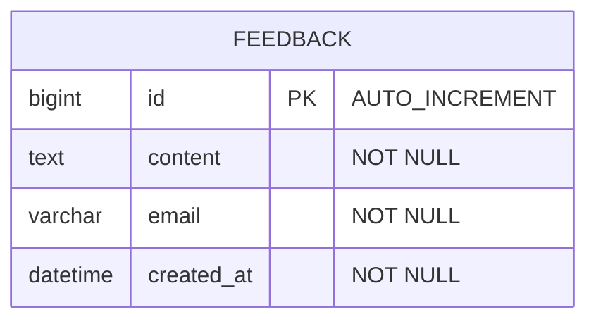

# 🎄 HATI (Holiday Animal Type Indicator)

> **연말을 준비하는 나는 어떤 동물일까?**  
> MBTI 기반 12개 문항으로 나의 연말 동물 유형을 알아보는 심리 테스트 웹 애플리케이션

---

## 💡 Introduction

연말 시즌을 맞아 자신의 성향을 동물로 표현한 재미있는 심리 테스트입니다.  
MBTI 기반의 12개 문항을 통해 나만의 연말 동물 유형을 발견해보세요!

### ⭐️ 주요 기능

- 🎯 **12개 문항 심리 테스트** - 약 3분 소요
- 🐶 **16가지 연말 동물 유형** - 각 MBTI 유형별 고유한 동물 캐릭터와 성격 설명 제공
- 🎄 **크리스마스 테마** - 따뜻한 연말 분위기
- 💬 **피드백 기능** - 사용자 의견 수집
- 🔗 **링크 공유 최적화** - Open Graph 메타 태그 지원


---

## 📋 프로젝트 개요

### 프로젝트 목적

연말 시즌을 맞아 사용자들이 재미있게 자신의 성향을 알아볼 수 있는 심리 테스트 서비스를 개발했습니다.
MBTI 기반의 12개 문항을 통해 16가지 연말 동물 유형 중 하나를 결과로 제공하며,
사용자들이 결과를 공유하고 피드백을 남길 수 있는 기능을 구현했습니다.

### 프로젝트 목표

- **사용자 경험 최적화**: 직관적이고 재미있는 테스트 경험 제공
- **공유 기능 강화**: Open Graph 메타 태그를 통한 소셜 미디어 공유 최적화
- **전체 스택 구현**: Frontend부터 Backend, Database, 배포까지 전 과정 경험
- **실제 서비스 운영**: 배포 후 실제 사용자 피드백 수집 및 개선

### 프로젝트 선택 이유

**우아한테크코스 8기 프리코스 오픈미션**으로 진행한 프로젝트입니다.
심리 테스트라는 재미있는 주제를 선택하여 사용자들이 즐겁게 사용할 수 있는 서비스를 만들고,
동시에 프론트엔드와 백엔드 전반의 기술 스택을 학습하고 적용할 수 있는 기회로 활용했습니다.

---

## 🧩 Server Architecture

// 시스템 아키텍쳐 추가 예정

---

## ⚙️ Tech Stack

| 구분          | 사용 기술                                      |
|--------------|----------------------------------------------|
| **Backend**  | Java 17, Spring Boot 3.4.11, Spring Security  |
| **Database** | MySQL, Spring Data JPA                       |
| **Infra**    | Railway                                      |
| **DevOps**   | Docker                                       |

----

## 📌 ERD



### Table

| 테이블명   | 설명                                 |
| ---------- | ------------------------------------ |
| `feedback` | 사용자 피드백 정보를 저장하는 테이블 |

### Fields

| 필드명       | 타입     | 설명                                         |
| ------------ | -------- | -------------------------------------------- |
| `id`         | BIGINT   | 피드백 고유 ID (Primary Key, Auto Increment) |
| `content`    | TEXT     | 피드백 내용                                  |
| `email`      | VARCHAR  | 사용자 이메일                                |
| `created_at` | DATETIME | 피드백 작성 시간 (자동 생성)                 |


----

## 🗂️ Project Structure

| 폴더명                              | 설명                               |
| ----------------------------------- | ---------------------------------- |
| `src/main/java/com/hati/controller` | REST API 컨트롤러                  |
| `src/main/java/com/hati/service`    | 비즈니스 로직 서비스               |
| `src/main/java/com/hati/repository` | 데이터베이스 접근 계층             |
| `src/main/java/com/hati/domain`     | JPA 엔티티                         |
| `src/main/java/com/hati/dto`        | 데이터 전송 객체                   |
| `src/main/java/com/hati/config`     | 설정 클래스 (CORS, Security)       |
| `src/main/resources`                | 설정 파일 (application.properties) |

<details>
<summary>📂 자세한 폴더 구조 (클릭해서 열기)</summary>

```plaintext
hati-be/
├── src/main/java/com/hati/
│   ├── controller/
│   │   └── FeedbackController.java      # REST API 엔드포인트 정의
│   ├── service/
│   │   └── FeedbackService.java        # 비즈니스 로직 처리
│   ├── repository/
│   │   └── FeedbackRepository.java     # 데이터베이스 접근 계층 (JPA)
│   ├── domain/
│   │   └── Feedback.java               # JPA 엔티티 (피드백 테이블 매핑)
│   ├── dto/
│   │   ├── FeedbackRequest.java        # 요청 데이터 전송 객체
│   │   └── FeedbackResponse.java       # 응답 데이터 전송 객체
│   ├── config/
│   │   ├── SecurityConfig.java         # Spring Security 설정
│   │   └── WebConfig.java              # CORS 설정
│   └── HatiBeApplication.java          # Spring Boot 메인 애플리케이션
├── src/main/resources/
│   └── application.properties          # 데이터베이스 연결 등 설정 파일
├── Dockerfile                          # Docker 이미지 빌드 설정
└── build.gradle                        # Gradle 빌드 설정
```
</details>

---

## 🚀 Deployment URL

- [HATI 바로가기](https://myhati.vercel.app/)

---

## 🙋🏻‍♂️ Server Engineers

| Soyeong |
| ------- |
|  |
| <a href="https://github.com/soyeong0115"></a> |

